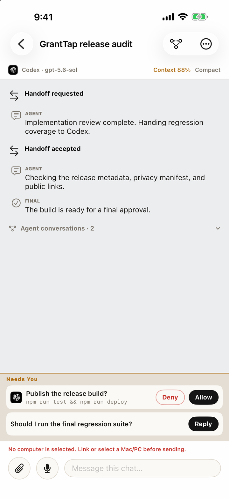
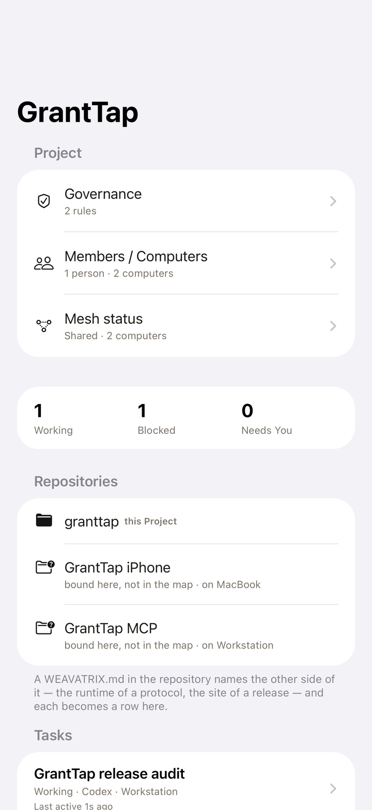

# GrantTap for iPhone, iPad, and Apple Watch

This repository publishes the SwiftUI source for the GrantTap Apple app. GrantTap
shows local coding-agent work, approvals, and task activity on iPhone, iPad, and
Apple Watch. The app is a free download; its encrypted relay and background
delivery are offered through an in-app subscription. Source visibility does not
change those service terms.

The Apple app is **not MIT-licensed**. Its existing [license](LICENSE) applies to
this source and artwork. The companion [MCP runtime](https://github.com/sergii-ziborov/granttap-mcp),
[relay](https://github.com/sergii-ziborov/granttap-relay), and
[website](https://github.com/sergii-ziborov/granttap-site) have their own licenses.

## App screenshots

These iPhone screenshots use demo tasks and computers; they do not show a live
account or promise that a tool-reported success has changed a file.

| Now: requests and active work | Task: conversation and approvals | Task: execution and runtime observations |
|:--:|:--:|:--:|
|  |  |  |

| Project: repositories and Mesh | Project Governance | Join a Project by QR |
|:--:|:--:|:--:|
|  |  |  |

## Build

Open `apps/ios/GrantTap.xcodeproj` in Xcode and select the `GrantTap` scheme. For
an unsigned simulator build:

```sh
xcodebuild -project apps/ios/GrantTap.xcodeproj -scheme GrantTap \
  -destination 'generic/platform=iOS Simulator' CODE_SIGNING_ALLOWED=NO build
```

Select your own development team to sign a personal device build. Push
notifications and distribution require the corresponding Apple capabilities and
provisioning. The watch app is embedded by the iOS scheme.

See [Apple app documentation](apps/ios/README.md),
[subscription behavior](docs/subscriptions.md), and [security](SECURITY.md).
