# GrantTap Personal

> **See what your coding agents are doing. Step in when they need you.**

GrantTap is a Personal live control center for local coding agents on iPhone,
iPad, Apple Watch, and Mac. It brings sessions from several computers into three focused
journeys:

- **See** what needs you, what is working, and what is at risk.
- **Decide** approvals, questions, retries, and the task's approval behavior.
- **Continue** the same task with chat, voice, photos, and files.

Project Mesh keeps one Task identity while execution moves between agents or
computers. Agents see compact owners, dependencies, expiring resource claims,
and relevant structured events — each execution only within its own Project —
while human attention still enters the existing Needs You inbox only for
product/security decisions, unresolved conflicts, failed handoffs, or a task
explicitly blocked on the user. Needs You opens the Task itself, so a Grok Bot
actor, an offline computer, or a pending handoff is never a dead end, and a
question answered there is published back to the agent that asked.

A handoff moves committed state. When the source checkout still has
uncommitted changes, a direct handoff is refused. An explicit checkpoint can
commit that work on a separate branch before the handoff proceeds.

Claude Code and Codex support the primary control paths. Cursor joins the Task
view and supported local controls; Grok Build appears where its installed
integration can report reliable work. Each provider shows the control depth it
actually supports.

The phone app is a free download. A one-time Mac license is prepared at USD
39.99; its App Store listing and price are not live yet. The license includes
local control and personal/internal own-relay use. Personal is optional: direct
mode uses only encrypted address discovery, and fully self-hosted mode uses
your own endpoint. See [purchase and connection modes](docs/subscriptions.md).

Hosted remote infrastructure — the encrypted relay,
background wake, and the bounded server queue — is an auto-renewable
subscription after a seven-day trial, priced by how many computers you link:
USD 1.99 for up to two, 3.99 for up to five, 5.99 for up to ten, and 9.99 for
up to fifteen. Coding agents on each computer are unlimited and are never counted or charged for. The
subscription never buys model access, and local history stays available if it
lapses.

## Current product

<p align="center">
  
  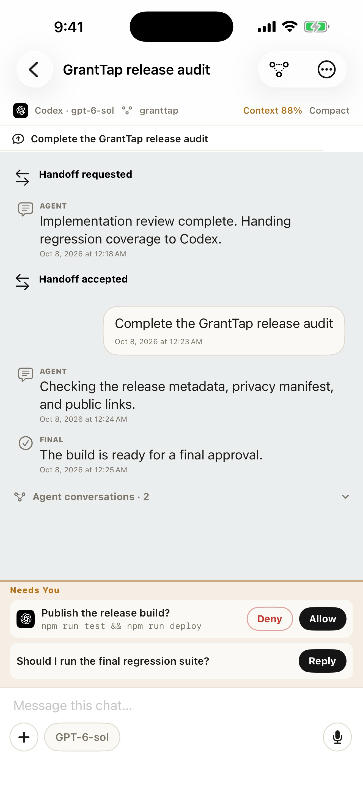
  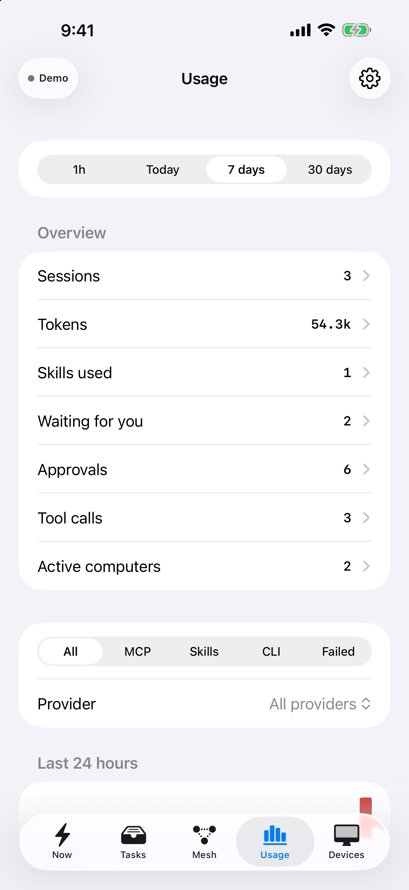
</p>

<p align="center">
  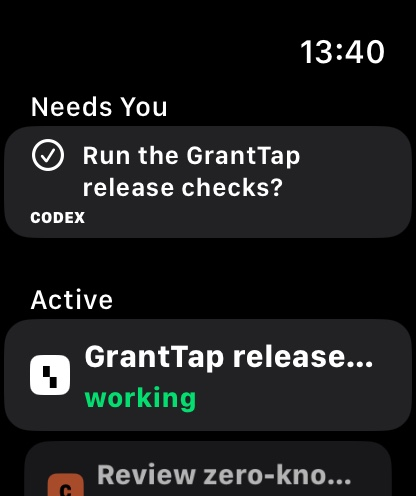
  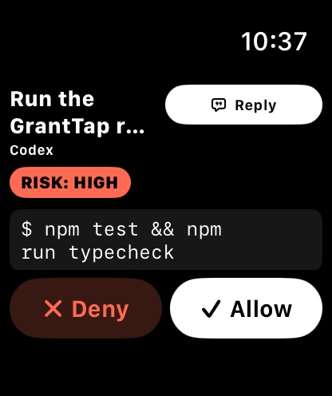
</p>

<p align="center">
  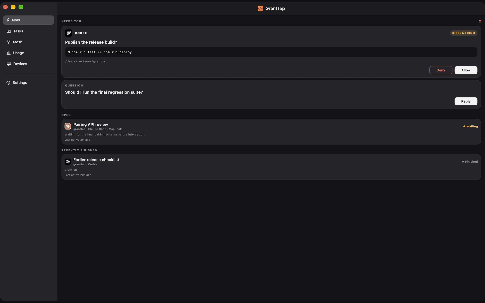
  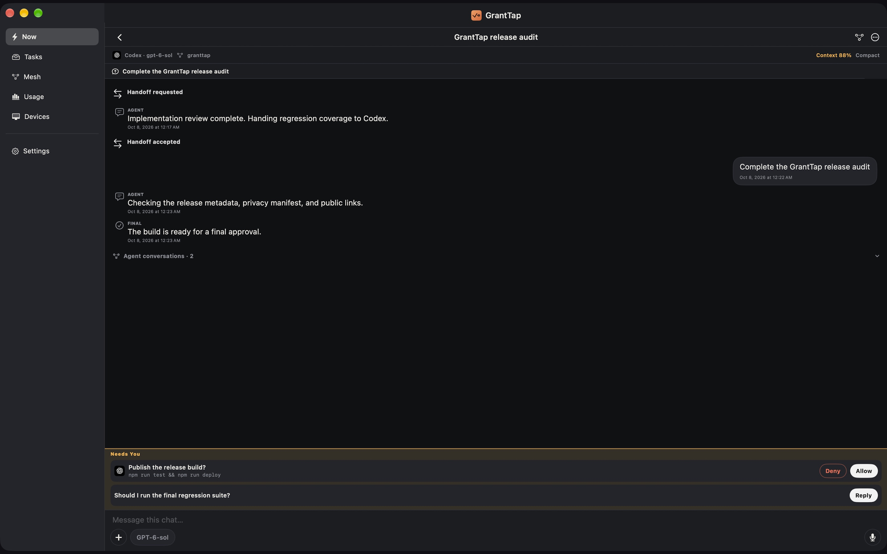
</p>

<p align="center"><em>Current iPhone, Mac and Apple Watch screens with deterministic sample tasks; no private user work is shown. The Mac images are from the signed SwiftUI Catalyst app.</em></p>

The [Mac guide](apps/macos/README.md) explains local MCP authorization,
Account Mesh and direct QR pairing. [Mac App Store screenshots](apps/macos/AppStore/Screenshots/en-US/Mac)
show Now, Tasks, a conversation, Usage and Mesh. Mac build 163 passed Apple
processing and is assigned to the internal TestFlight group. The public Mac
App Store release is not yet available for purchase.

## Product shape

```text
NOW       Needs You · At Risk · Working · Recent
TASKS     Active · History · Search · New Task
USAGE     Sessions · Context · Waiting · Tools · Where the time went

TASK      Live activity/chat · Approvals · Reply · Attachments · Voice
TASK      Controls · Model and effort · Task history
MESH      Project · Stable Task · Executions · Claims seen and said · Checkpoint handoff
MESH      Governance · Members and computers · Load by computer · Also being edited
WATCH     Needs You · Active · Short reply · New voice task
```

Task screens open directly into the visible timeline, which the phone keeps
itself: a chat that has been read once is not fetched and decrypted again.
Opening a Runtime entry opens the matching execution's chat.
History shows the timestamp of the latest visible chat message when the
provider records one. If that timestamp is unavailable, it labels the fallback
as last activity rather than presenting a sync time as a message time.

Capabilities are Project policy, not per-task switches. Skills, MCP servers and
shell access are decided in Governance — for a whole kind or for one named
capability alone — and a task reports what it will meet instead of offering a
second switch beside it. A rule is written where the need for it appears:
touch and hold a tool, and a refusal is shown in the chat beside the call it
stopped, naming the rule.

The Mesh warns before the merge does. A requested edit becomes an expiring
intent claim, not proof that the file changed. Claims use repository identity
and path segments: identical relative paths in different repositories do not
collide; another checkout of the same repository is a coordination warning.
A checkpoint can commit uncommitted work to a separate branch on the source
computer before handoff, touching nothing else and pushing nothing unless that
handoff explicitly asks to push. Capability availability and observed usage remain
separate: unknown usage is never presented as confirmed use.

The Task's Runtime section requests a bounded, content-free Invocation history
from each connected computer under the Project encryption key. A request,
reported result, refusal, and transcript gap are distinct facts. Only a separate
filesystem observation with repository, revision, and content hash may be shown
as a verified change. This history requires the local GrantTap Engine; a computer
without it reports the section unavailable rather than presenting Usage samples
as a durable audit trail. The phone does not persist this history in plaintext.
This release does not yet generate verified filesystem-change events or connect
Invocation entries to revision-bound impact and downstream consumers. The
Runtime screen therefore shows requests, reported results, denials, and gaps;
it never invents a confirmed change or impact link.

Cost is reported at the level that can answer for it. A task reports what its
own run spent, a Project reports which of its computers is carrying it, and
Usage reports the machine as a whole. Resource figures are marked attributed
rather than measured, because a finished call is read back from a transcript and
can only be costed from the samples taken while it ran.

Usage observations are not admission budgets. The current release does not
provide a strict spending cap or a use-only credential broker. A secret passed
as a Project Environment value is available to its agent process and code it
can run; masking that value in the phone does not isolate it from that process.

## Project Mesh on the phone

<p align="center">
  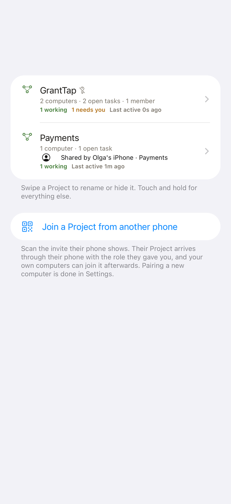
  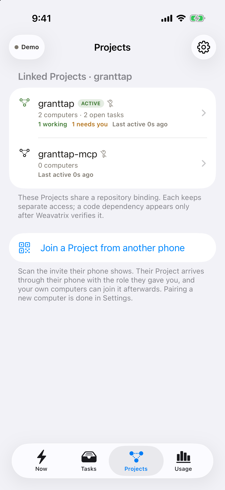
  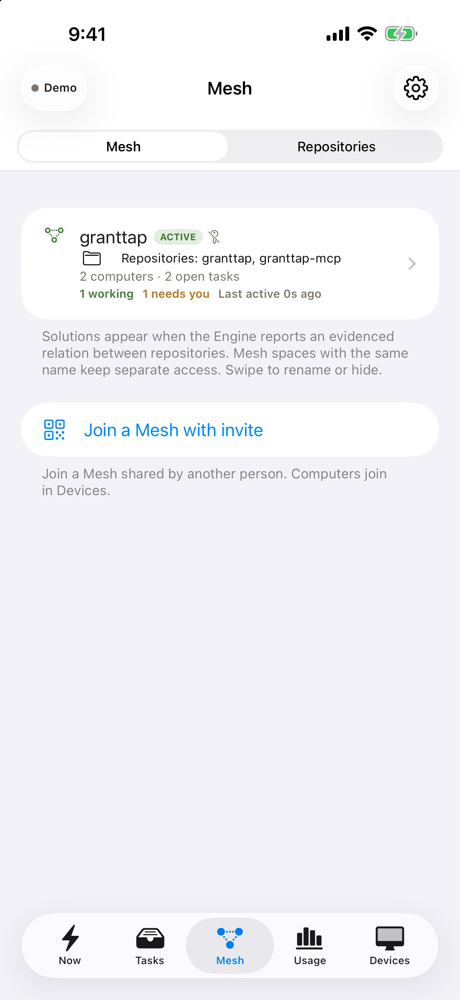
  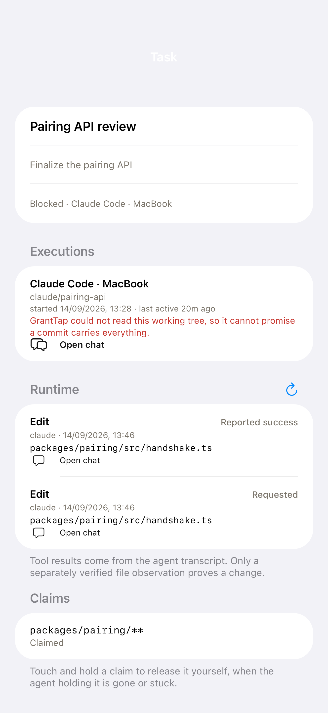
  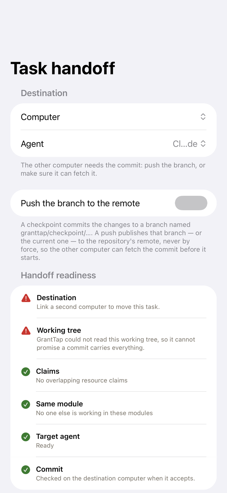
</p>

<p align="center"><em>Projects shared between phones · linked repository bindings with separate Project access · Project management · a Task with executions and claims · handoff readiness</em></p>

<p align="center">
  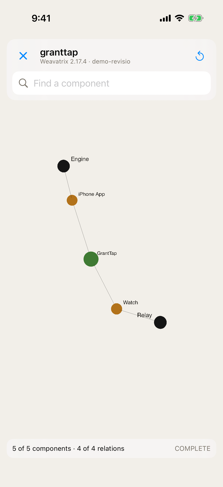
  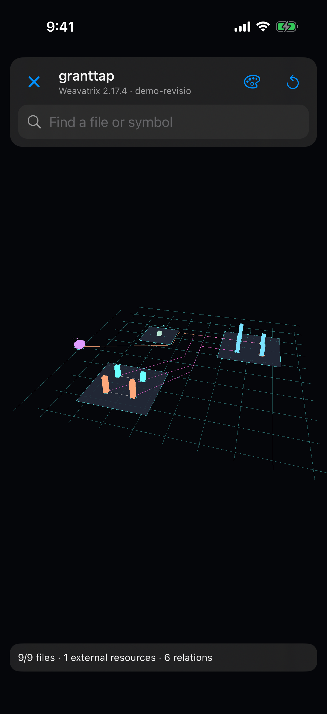
</p>

<p align="center"><em>Simulator captures with sample reports; the live app marks missing Engine architecture evidence as unavailable.</em></p>

<p align="center">
  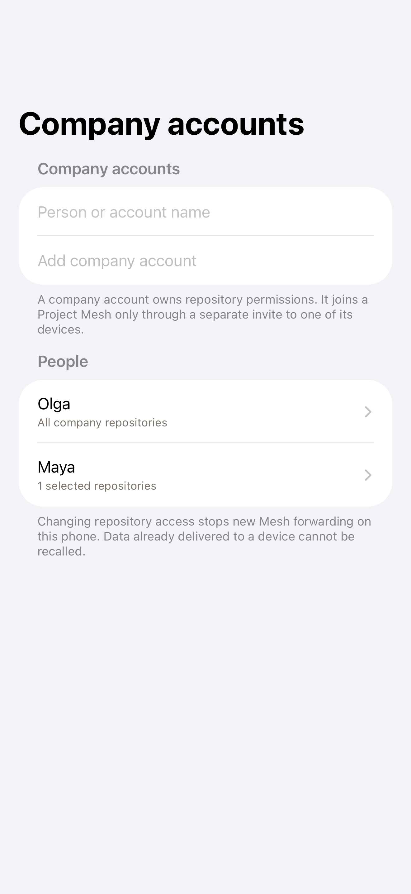
  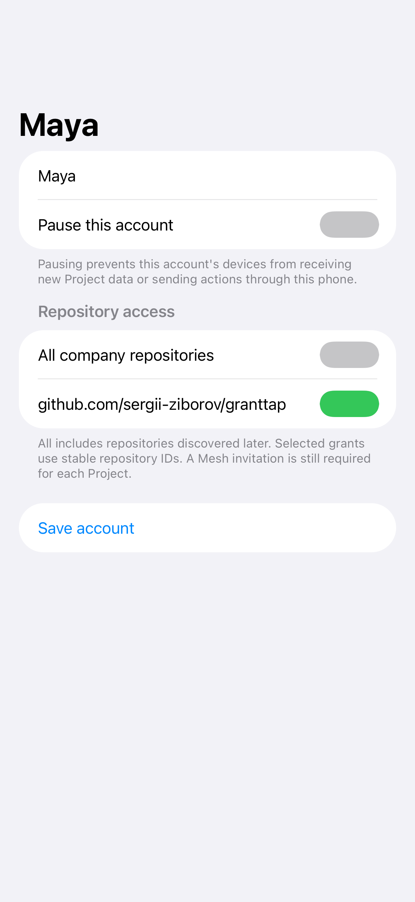
  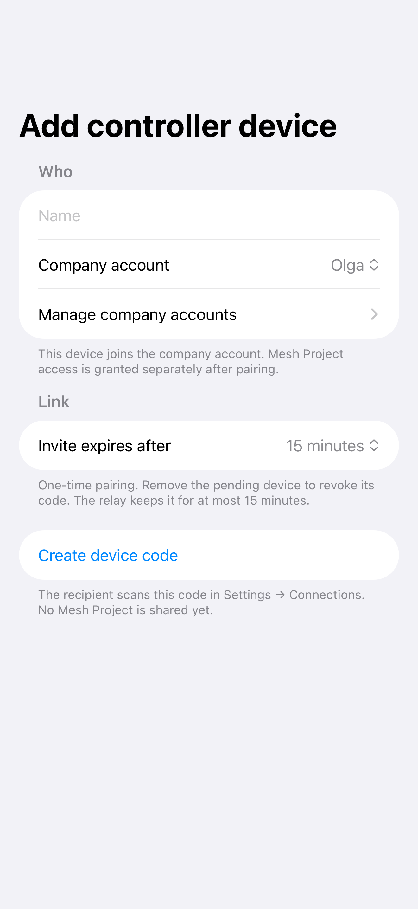
  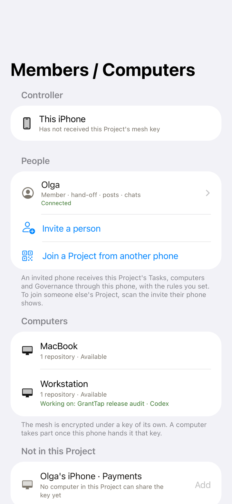
  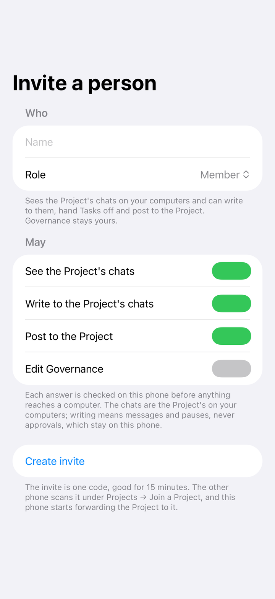
  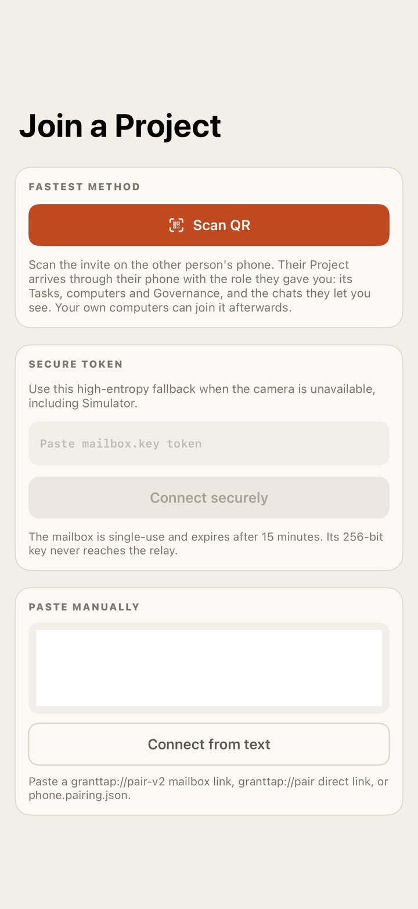
  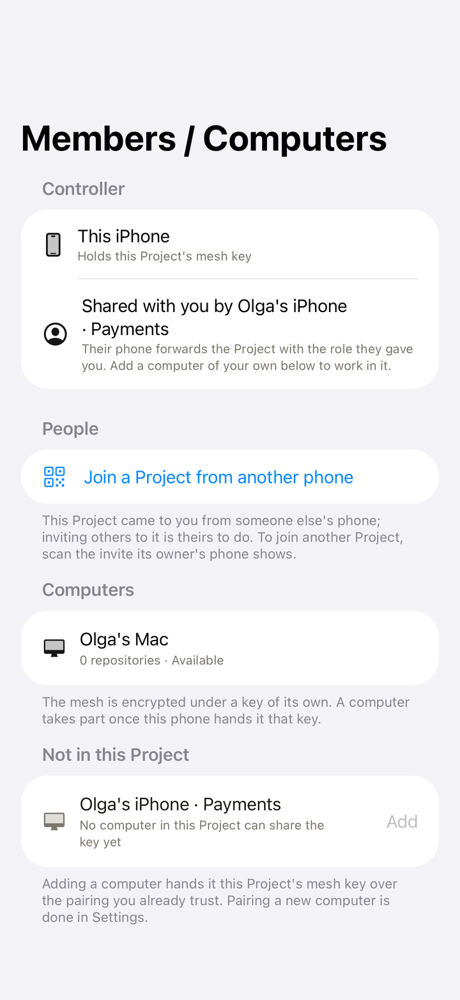
</p>

<p align="center"><em>Company repository grants · separate Project Mesh roles and device pairings · joining from another phone</em></p>

<p align="center">
  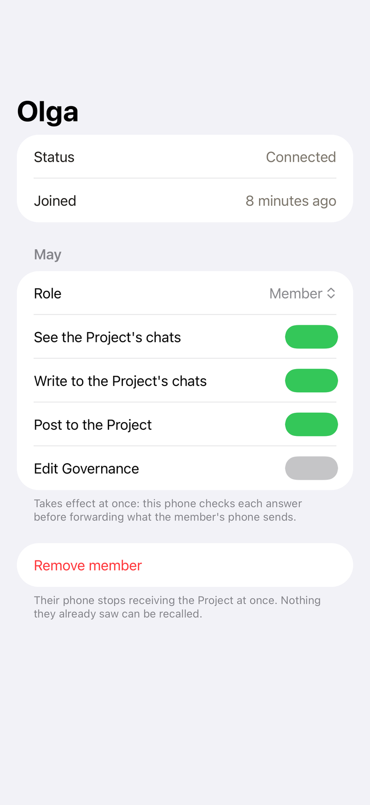
  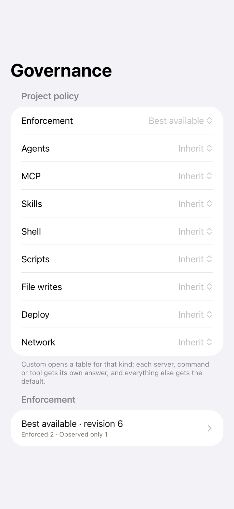
  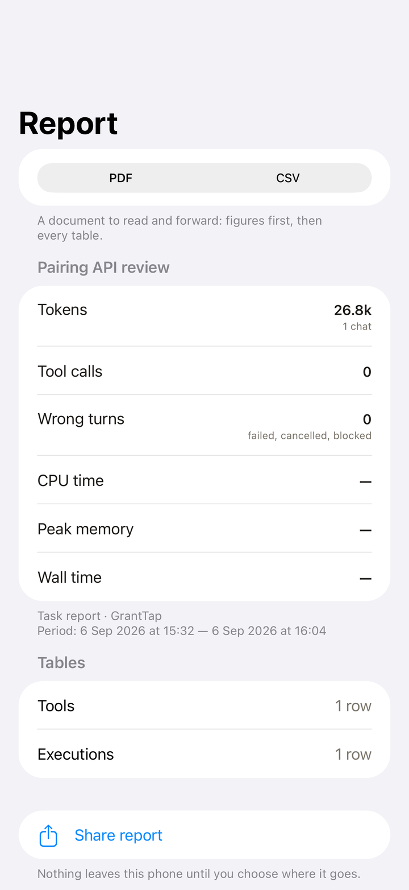
  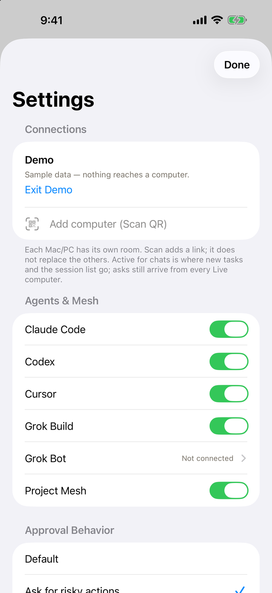
</p>

<p align="center"><em>A member's answers, changed at once · Governance · a Task report · Settings</em></p>

A Project is shared from the phone that owns it, and that phone stays the
hub. The owner first creates a **company account** and grants it one, selected,
or all repository IDs under Members / Computers → Company accounts. A company
account is a person-level repository grant; it does not join any Project Mesh.
The owner can pair a phone or tablet to that account before any computer or
Project exists using Company accounts → Add controller device. The recipient
scans its one-time code in Settings → Connections. That pairing alone grants
no Project. The owner then gives the device selected Project Mesh scopes and
a Project role. Two devices can use the same company account while
keeping separate pairings and Mesh permissions. A Project snapshot containing
several repositories is forwarded only when the account covers all of them;
linked sub-Mesh Projects still require separate selection. These grants govern
GrantTap forwarding on the owner's phone and do not change Git provider ACLs.

An invite is a one-time code, good for fifteen minutes; the Project
arrives on the other phone with the role the owner chose — Viewer, Member,
or Admin — and the answers under it: see the Project's chats, write to them,
post to the Project, edit Governance. Each answer is checked on the owner's
phone before anything is forwarded to a computer, and a refusal comes back
to the member as a message of its own, naming the rule. A member adds
computers of their own, which take part in the mesh like any other: their
chats are the Project's, their claims are seen everywhere, and a Task can be
handed to them.

A claim left behind by an agent that is gone is released by the person from
the Task screen. The computer that holds it answers with a result: released,
or refused with the reason, and a refusal puts the claim back on the phone
with that reason beside it. A Task is reported as a PDF or a CSV, and nothing
leaves the phone until you choose where it goes.

## Install one helper

The canonical machine runtime, provider adapters, TypeScript protocol, CLI,
and MCP server live in
[`granttap-mcp`](https://github.com/sergii-ziborov/granttap-mcp).

```bash
# Codex plugin
codex plugin marketplace add sergii-ziborov/granttap-mcp
codex plugin add granttap@granttap

# Claude Code plugin
claude plugin marketplace add sergii-ziborov/granttap-mcp
claude plugin install granttap@granttap

# Background helper and provider hooks
npm install -g granttap-mcp
granttap setup
```

Open **Devices** on iPhone, iPad, or Mac and create or join an Account Mesh with
the same passkey. It exists on the relay before any computer is connected and
can hold many Project Meshes and computers. When the local helper is installed,
the Mac app links it to that Account Mesh; the MCP connection card can also
join with the same passkey. Devices shows the linked computers and their real
display names. A Task still follows its own selected computer route.

For a direct device link without an account, open the GrantTap connection card
in a coding app, choose **Add a device**, and scan its one-time QR with iPhone
or iPad. Pairing material stays out of chat. The online Mac seals a fresh phone
pairing half to an ephemeral iPhone key.
The account service sees machine metadata and ciphertext, never a readable
pairing key or chat. QR remains available without an account. This account is
separate from the company account used for Project Mesh invitations.

Normal CLI commands are `setup`, `status`, `connect`, `reset`, and
`mesh connect`. The public MCP server exposes exactly `connect`, `notify`,
`ask_yes_no`, and `ask`, plus the read-only `granttap://mesh/current` resource.
Setup, Mesh invites, and Project scope are explicit local administrative
actions and are never MCP capabilities.

Settings → **Agents & Mesh** owns the runtime gate for each agent and for
Project Mesh. Disabling one stops new GrantTap monitoring without uninstalling
the agent or deleting local task, history, and usage records.

## Repositories

- [`granttap`](https://github.com/sergii-ziborov/granttap) — iPhone, iPad, watchOS, Mac,
  Apple-specific shared client, Swift models, and App Store tests.
- [`granttap-mcp`](https://github.com/sergii-ziborov/granttap-mcp) — canonical
  machine runtime, hooks, adapters, protocol, CLI, and MCP server.
- [`granttap-relay`](https://github.com/sergii-ziborov/granttap-relay) — public
  ciphertext relay and bounded offline queue.
- [`granttap-site`](https://github.com/sergii-ziborov/granttap-site) — public
  product, install, security, pricing, and legal pages.

The [macOS Desktop app](apps/macos/README.md) reads local MCP connection health
and Engine Project data alongside the iPhone, iPad, and Apple Watch surfaces.

## Licensing

The Apple-client source in this repository uses the [GrantTap Commercial
Source License](LICENSE). The Mac app has a separate
[commercial end-user license](apps/macos/DESKTOP_EULA.md), alongside mandatory
Apple Usage Rules when sold through the App Store. The standalone `granttap-mcp` repository is
MIT licensed. The current first-party relay and website source use commercial
source licenses; earlier copies validly released under MIT keep their original
rights. Third-party components keep their own licenses.

Legacy experiments were preserved in local archival branches before the
Personal simplification. They are absent from Personal release targets and
public product surfaces.

## Security boundary

Native iPhone and Apple Watch traffic is end-to-end encrypted. Pairing creates
endpoint keys locally and transfers them through a one-use mailbox protected by
an independent QR/manual-token key. Each attached task receives a separate key.

The relay can see bounded routing metadata, timing, expiry, ciphertext size,
IP addresses, and APNs routing metadata. It cannot read prompts, commands,
questions, replies, attachments, decisions, or provider credentials. APNs
contains only a generic wake. See [SECURITY.md](SECURITY.md) and the public
[`granttap-relay`](https://github.com/sergii-ziborov/granttap-relay) source.

Mesh snapshots and Task Capsules use project/task keys granted only to linked,
explicitly addressed endpoints. A handoff creates a separate branch/worktree,
keeps the same `taskId`, and carries explicit facts plus a verified receipt—not
transcripts or hidden model reasoning.

## Development

```bash
npm install
npm run typecheck
npm test
npm run inventory
```

Apple release gates also include Xcode test-with-coverage, build, analyze,
localization/privacy validation, Simulator E2E, repeated task opens, pairing,
approval, offline/reconnect, multi-computer, Watch decisions, and a signed
install that does not uninstall the existing physical-iPhone app.

Do not publish or push from this repository without explicit authorization and
successful release gates.

GrantTap is not affiliated with Anthropic, OpenAI, Anysphere, xAI, Apple, or
Cloudflare.

### Repository activity and automatic task placement

On Mac, iPhone and iPad, Mesh → Repositories shows working repositories first.
Repository details include related tasks and Mesh scopes, observed branches,
working tree state, recent commits and contributors. Git observations require
MCP 0.8.29 source or later; missing data is shown explicitly. Tasks started in
another Mesh are presented under the unique visible Mesh matching their
confirmed execution repository. Original Task IDs, history and permissions
remain intact, with links explaining where the task started.

## Built-in Help on Apple devices

On Mac, **Help → GrantTap Help** and **GrantTap → About GrantTap** open pages
in the main application window. Settings on Mac, iPhone and iPad contains the
same help, Terms, Privacy, licenses and pricing documents, readable offline.
Purchase prices are loaded from StoreKit for the storefront. The US Mac launch
plan is $39.99 once; optional Personal tiers are $1.99, $3.99, $5.99 and
$9.99 monthly for up to 2, 5, 10 and 15 computers. See
[subscriptions](docs/subscriptions.md).
